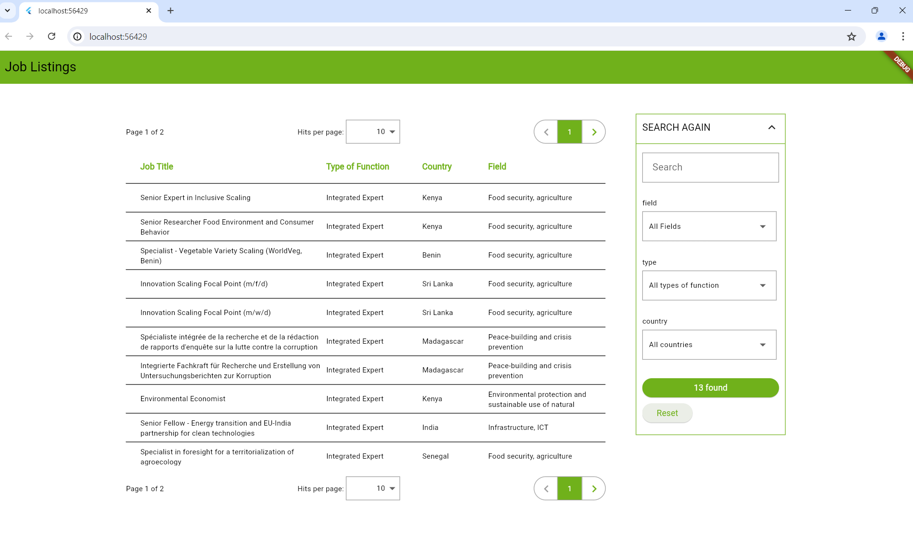
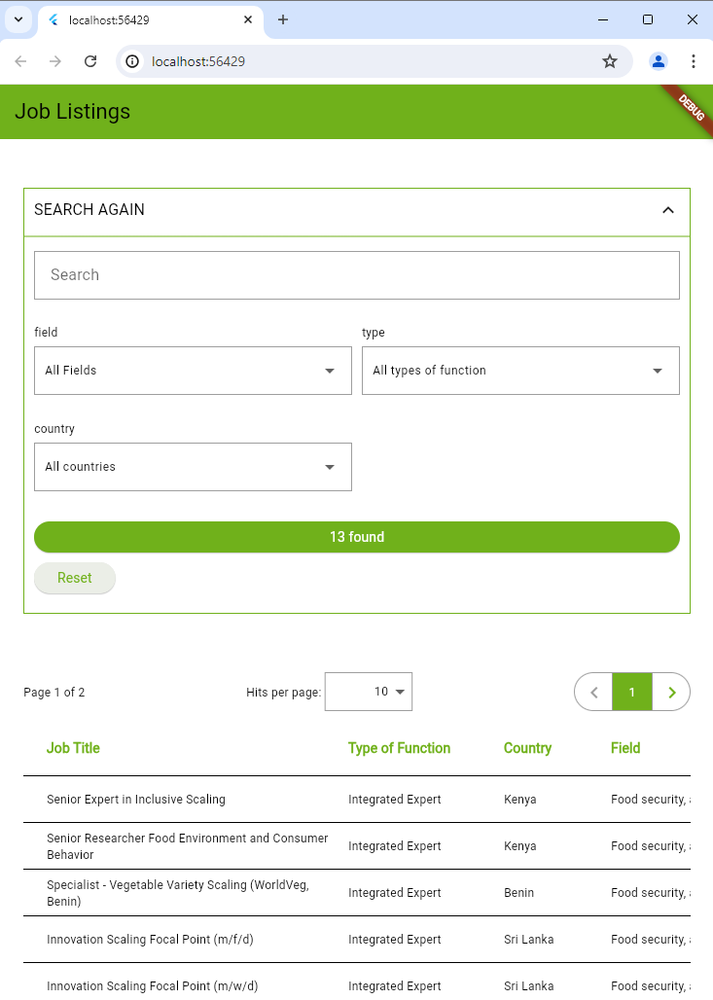
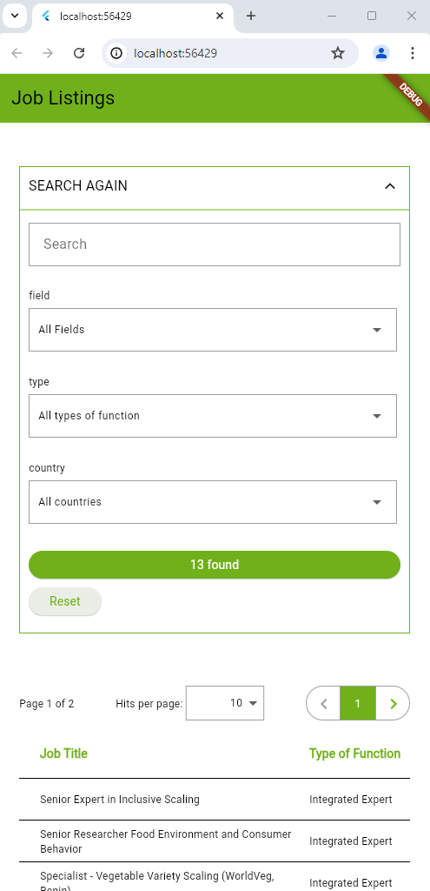

## Responsive Data Table with Customizable Filters and Pagination

To run this project, use the following command:
```sh
flutter run -d chrome
```



### Overview
The **Responsive Data Table** project is a meticulously crafted template designed to cater to modern data presentation needs. This template provides a comprehensive, user-friendly, and visually appealing solution for displaying large datasets with features such as customizable filtering, pagination, and responsive design. Perfect for web applications, dashboards, and any data-intensive environment, this template ensures seamless data interaction and presentation across all devices.

### Key Features

#### 1. **Customizable Filters**
- **Dynamic Filter Generation**: Automatically generates filters based on the dataset, allowing users to easily refine their search.
- **Multiple Filters per Row**: Customize the number of filters displayed per row to optimize screen real estate and user experience.
- **Real-Time Filter Application**: Instantly apply filters to the data table without the need for page reloads, ensuring a smooth and efficient user experience.

#### 2. **Robust Pagination**
- **Customizable Rows Per Page**: Users can select the number of rows displayed per page, enhancing control over data presentation.
- **Page Navigation**: Intuitive controls for navigating between pages, ensuring easy access to all data entries.
- **Total Hits Display**: Clearly shows the total number of data entries found, providing users with a comprehensive overview of the dataset.

#### 3. **Responsive Design**
- **Adaptive Layouts**: Automatically adjusts the layout and presentation of the data table and filters to fit any screen size, from large desktop monitors to compact mobile screens.
- **Horizontal Scrolling**: Enables horizontal scrolling for the data table on smaller screens, ensuring that all columns are accessible without compromising readability.
- **Mobile-Optimized Interaction**: Simplified touch interactions and optimized elements for mobile use, ensuring a seamless experience on smartphones and tablets.

### Technical Specifications

#### 1. **Customizable Data Table**
- **Custom Columns**: Easily configure the columns of the data table, including their visibility and width.
- **Sortable Columns**: Users can sort data by clicking on column headers, allowing for quick and efficient data organization.
- **Customizable Styling**: Tailor the appearance of the data table to match your application's theme and branding.

#### 2. **Filter Widget**
- **Search Bar**: Integrated search bar for quick keyword searches across the dataset.
- **Custom Dropdowns**: Stylish and customizable dropdown menus for selecting filter criteria.
- **Expandable and Collapsible Sections**: Users can expand or collapse the filter section, saving space when filters are not in use.

#### 3. **Integration and Customization**
- **Easy Integration**: Seamlessly integrate the data table template into your existing web application with minimal effort.
- **Highly Customizable**: Comprehensive options for customizing the look, feel, and functionality to meet specific project requirements.

### Use Cases

- **Business Dashboards**: Ideal for displaying and interacting with business metrics, sales data, and operational reports.
- **E-commerce Platforms**: Perfect for managing product inventories, customer data, and order histories.
- **Educational Portals**: Useful for presenting student records, course data, and academic performance reports.
- **Healthcare Systems**: Efficiently manage patient records, medical histories, and appointment schedules.

### Conclusion
The **Responsive Data Table with Customizable Filters and Pagination** template is an amazing solution for anyone looking to present large datasets in a clean, organized, and user-friendly manner. With its powerful features and responsive design, this template ensures that your data is always accessible and easy to navigate, regardless of the device or screen size. Elevate your data presentation and user experience with this versatile and robust data table solution.

### Inspiration Source
This project was inspired by the job listings page from [CIM Online](https://jobs.cimonline.de/index.php?ac=search_result).

## Views
### Desktop


### Tablet


### Phone
